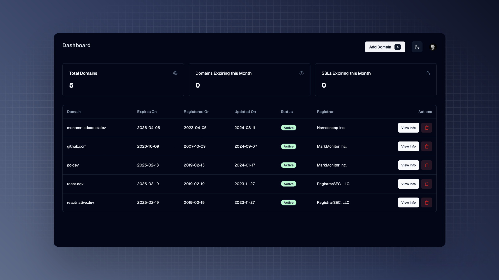
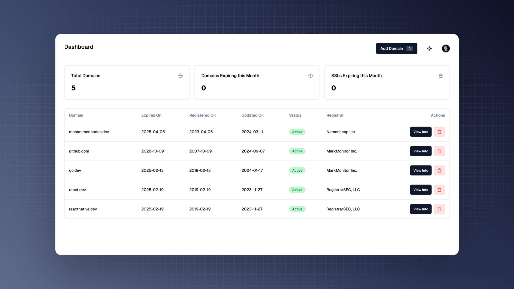

#  Domain Management Application

Easily manage all your domains, see when they were registered, when they’ll expire, current DNS records, the registrar and more.

## Tech Stack

**Client:** React, React Router, SWR, Day.js

**Styling:** shadcn/ui, HeadlessUI, Tailwind

**Server:** Node, Express, Whoiser

**Database:** Postgres, Prisma

**Auth:** Clerk

**Tooling:** Vite, PostCSS, ESLint, Prettier

## Todo

Features:
- [ ] Store DNS records / SSL information in database
- [ ] Refetch data on a cron - every 6 or 24 hours.
- [ ] Show SSL certificate issuer

Code Structure:
- [ ] Look at ways to improve app structure, API design, client-side data fetching methods, caching etc.
- [ ] Implement React and Express "best practices"
